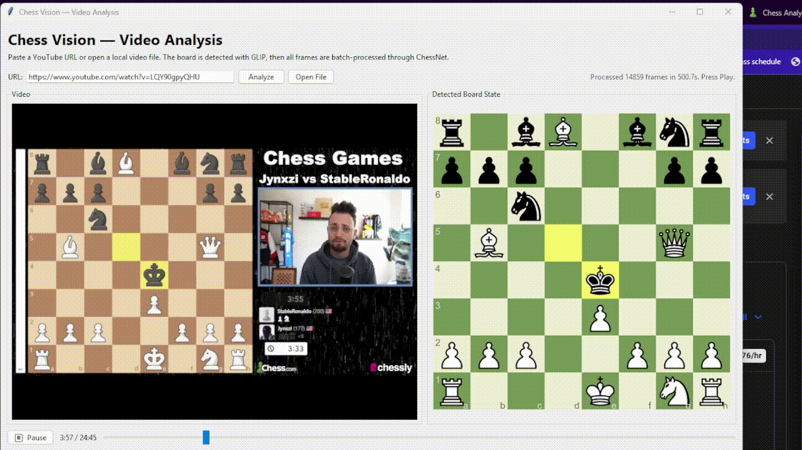

# ChessVisor

ChessVisor is a computer-vision project for reading annotated chess boards from screenshots and video. As part of the [Chessformer](https://github.com/jdoughty04/Chessformer) project, it lays foundations for a positional-commentary collection tool, enabling the pairing of real chess commentary with associated board positions, highlights and arrows drawn in educational chess videos. The model predicts:

- Piece placement on all 64 squares
- Highlighted squares
- Drawn arrows
- Board orientation

The repo includes the full loop: synthetic data generation, training, image inference, and a video GUI that tracks the board over time.

[](inference_gui.gif)

In a fuller system, board states, highlights, and arrows extracted from instructional videos could be paired with the spoken commentary or transcript, helping disambiguate references like "this square" or "that idea" and making the resulting data more useful for downstream chess explanation models.

## Main entry points

- `inference.py`: desktop GUI and CLI for screenshots or single images. Full screenshots are auto-cropped with GLIP-style GroundingDINO board detection before running ChessNet.
- `video_gui.py`: video player plus timeline analysis for local videos or YouTube URLs. It detects the board once, then follows the position through the video.
- `generate_data.py`: creates synthetic training data.
- `train.py`: trains the model.
- `weight_gui.py`: optional live loss-weight control while training.

## Quick start

```bash
pip install -r requirements.txt
python inference.py
```

Useful commands:

```bash
python inference.py --image path/to/image.png
python inference.py --image path/to/cropped_board.png --skip-board-detection
python video_gui.py
python generate_data.py --count 5000 --output output/dataset
python train.py --data_dir output/dataset
```

## Notes

- `model.pth` and the rendering assets are already included, so the image demo can run immediately.
- The first board-detection run downloads the GroundingDINO checkpoint through `transformers`.
- `video_gui.py` also needs a local `mpv` or `libmpv` install for playback.
- `download_assets.py` is only needed if you want to refresh the bundled piece, board, and background assets.
